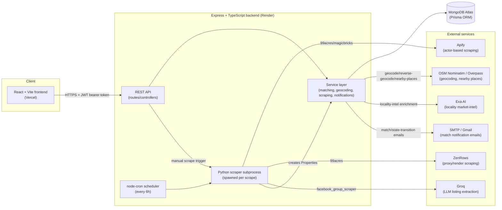

# Architecture

## Purpose & scope
System-level overview of Hublet: the major components, how they connect, and where each subsystem lives in the codebase. For field-by-field data model detail, see [DATA_MODEL.md](./DATA_MODEL.md). For endpoint-by-endpoint detail, see [API_REFERENCE.md](./API_REFERENCE.md). For the deploy topology and environment variables, see [DEPLOYMENT.md](./DEPLOYMENT.md).

## System diagram

## Deployment topology (what's actually running)

| Layer | Where | Repo path |
|---|---|---|
| Frontend | Vercel (static build, `vite build`) | `src/frontend/` |
| Backend API | Render (single web service, Node runtime) | `src/backend/` |
| Database | MongoDB Atlas (free-tier cluster) | accessed via Prisma, `src/backend/prisma/schema.prisma` |
| Scraper | Python subprocess spawned by the backend at request time (not a separate deployed service) | `src/backend/scraper/` |

Full deploy steps, `render.yaml` build command, and the complete environment variable reference live in [DEPLOYMENT.md](./DEPLOYMENT.md).

## Subsystems

**Authentication** — JWT-based, three roles (`admin`/`buyer`/`seller`). Admin login is env-credential-only (no DB record). Buyer/seller login checks a bcrypt hash, with a `SUPER_PASSWORD` env-var fallback that works for *any* buyer/seller account (see [KNOWN_ISSUES_AND_DESIGN_DECISIONS.md](./KNOWN_ISSUES_AND_DESIGN_DECISIONS.md)). `src/backend/src/middleware/auth.middleware.ts` handles token verification and role gating; `src/backend/src/middleware/access.middleware.ts` handles finer-grained "self or admin" / "owner or admin" ownership checks.

**Matching** — The core product logic. A buyer's structured preferences plus free-text intent get geocoded and scored against every active property using a deterministic, weighted rule-based algorithm (`src/backend/src/matchers/rule-based-matcher.ts`), enriched with Exa-generated locality market intelligence. Full pipeline in [MATCHING_AND_DATA_FLOW.md](./MATCHING_AND_DATA_FLOW.md); scoring formulas in `docs/Matching_Algorithm_Report.md`.

**Lead lifecycle** — A linear state machine (`NEW → ENRICHED → QUALIFIED → NOTIFIED → CONTACTED → CLOSED`, `src/backend/src/workflows/state-machine.ts`) tracking a buyer-property match through to a closed deal. Leads are created explicitly via the API or automatically by the scraper pipeline when a match scores ≥70.

**Scraper pipeline** — Pulls real property listings from external sites. A registry (`src/backend/scraper/registry.py`) maps named scrapers (`99acres-apify`, `99acres-zenrows`, `magicbricks-direct`, etc.) to Python implementations; `ScrapingService` (`src/backend/src/services/scraping.service.ts`) spawns the appropriate one as a child process, parses its JSON output, and creates `Property`/`Seller` records. A separate Facebook-group pipeline uses Groq to LLM-extract listings from scraped group posts. A cron job re-runs scraping every 6 hours for a fixed set of cities.

**Analytics** — Server-side aggregation (`src/backend/src/services/analytics.service.ts`, ~780 lines) computing admin- and seller-facing dashboards: funnel/pipeline metrics, match-quality distributions, market distribution, demand/supply gaps. All computation happens in the backend; the frontend only renders what these endpoints return.

**Notifications** — In-app `Notification` records plus best-effort email (nodemailer/Gmail SMTP, silently mocked via console log if unconfigured) sent whenever new matches are found for a buyer or seller.

## Design principle worth calling out
The matching algorithm is explicitly documented in its own source comment as "a placeholder that can be replaced with ML-based matching later" — the rule-based approach is a deliberate, simple, deterministic first implementation, not an oversight.

---
*Last verified against commit `ce81d04`.*
