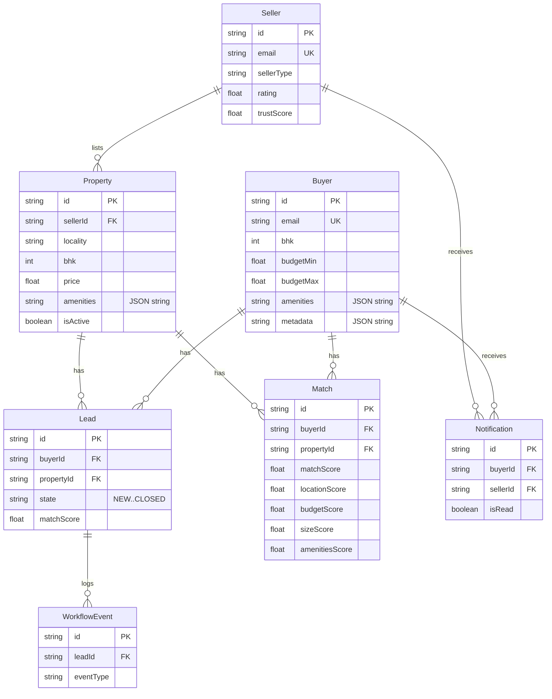

# Data Model

## Purpose & scope
Complete reference for every model in `src/backend/prisma/schema.prisma` — fields, relations, indexes — plus the MongoDB-specific modeling choices that shape how the service layer reads and writes data. See [ARCHITECTURE.md](./ARCHITECTURE.md) for how these models fit into the system, and [MATCHING_AND_DATA_FLOW.md](./MATCHING_AND_DATA_FLOW.md) for how `Match`/`Lead` get created.

## Entity-relationship diagram

## Models

All models use `id String @id @default(uuid()) @map("_id")` — a client-generated UUID string mapped onto Mongo's `_id`, not a native `ObjectId`. (`schema.prisma:14,45,72,112,140,165,185`)

### Buyer (`schema.prisma:13-42`)
| Field | Type | Notes |
|---|---|---|
| `name` | String | |
| `email` | String | `@unique` |
| `phone` | String? | |
| `passwordHash` | String? | bcrypt hash; absent for buyers created without a password |
| `areaMin`, `areaMax` | Int? | sq ft |
| `bhk` | Int? | indexed (`@@index([bhk])`) |
| `budgetMin`, `budgetMax` | Float? | |
| `amenities` | String (required) | JSON-encoded array of strings |
| `rawPreferences` | String? | original free-text intent input |
| `metadata` | String? | JSON-encoded object — holds `localityText`, `localityCoords`, `localities`, `city`, `source`, etc. |
| `createdAt`, `updatedAt` | DateTime | |

Relations: `leads Lead[]`, `matches Match[]`, `notifications Notification[]`.

### Seller (`schema.prisma:44-69`)
| Field | Type | Notes |
|---|---|---|
| `sellerType` | String, default `"owner"` | valid values: `owner`, `broker`, `agent` |
| `rating` | Float, default 0 | indexed |
| `ratingCount` | Int, default 0 | |
| `completedDeals` | Int, default 0 | |
| `trustScore` | Float, default 0 | indexed; computed by `SellerService.calculateTrustScore` (rating 70% + completedDeals 30%, capped) |
| `metadata` | String? | JSON-encoded |

Relations: `properties Property[]`, `notifications Notification[]`.

### Property (`schema.prisma:71-109`)
| Field | Type | Notes |
|---|---|---|
| `sellerId` | String | FK → `Seller`, `onDelete: Cascade` |
| `title`, `description?`, `locality`, `address?` | String | `locality` indexed |
| `area` | Int | sq ft |
| `bhk` | Int | indexed |
| `price` | Float | indexed |
| `amenities` | String (required) | JSON-encoded array |
| `propertyType` | String, default `"apartment"` | valid values: `apartment`, `house`, `villa`, `plot` |
| `contact` | String? | |
| `isActive` | Boolean, default true | indexed; set false by "mark sold" |
| `metadata` | String? | JSON-encoded — holds `coordinates`, `nearbyPlaces`, `marketIntel`, `marketIntelFailed`, `geocodeFailed`, `source` |

Relations: `leads Lead[]`, `matches Match[]`.

### Lead (`schema.prisma:111-137`)
| Field | Type | Notes |
|---|---|---|
| `buyerId`, `propertyId` | String | FKs, both `onDelete: Cascade` |
| `state` | String, default `"NEW"` | valid values: `NEW`, `ENRICHED`, `QUALIFIED`, `NOTIFIED`, `CONTACTED`, `CLOSED` — enforced by `LeadStateMachine`, see [MATCHING_AND_DATA_FLOW.md](./MATCHING_AND_DATA_FLOW.md) |
| `matchScore` | Float? | copied from the triggering match |
| `metadata` | String? | JSON-encoded |

Relations: `events WorkflowEvent[]`.

### Match (`schema.prisma:139-162`)
| Field | Type | Notes |
|---|---|---|
| `buyerId`, `propertyId` | String | FKs, both `onDelete: Cascade` |
| `matchScore` | Float (required) | weighted total |
| `locationScore`, `budgetScore`, `sizeScore`, `amenitiesScore` | Float? | per-component breakdown |
| `metadata` | String? | |

**`@@unique([buyerId, propertyId])`** — a buyer/property pair can only have one `Match` row; re-matching updates it rather than duplicating.

### WorkflowEvent (`schema.prisma:164-182`)
Append-only audit log. `eventType` valid values: `LEAD_CREATED`, `STATE_TRANSITION`, `MATCH_GENERATED`, `ERROR`, `INVALID_TRANSITION`. `leadId` is optional (some events, like `MATCH_GENERATED`, aren't always tied to a lead).

### Notification (`schema.prisma:184-200`)
Either `buyerId` or `sellerId` is set (not both), both optional and cascade-deleted with their owner. `isRead` indexed for the unread-count query.

## MongoDB-specific modeling choices

This schema is written for `provider = "mongodb"` (`schema.prisma:9`), and several choices exist specifically because of that:

1. **No native Prisma enums.** `Lead.state`, `WorkflowEvent.eventType`/`fromState`/`toState`, `Seller.sellerType`, `Property.propertyType` are all plain `String` fields with valid values documented only in code comments (e.g. `schema.prisma:118-119`), not enforced by the database or Prisma's type system — validity is enforced in application code (`LeadStateMachine`, `RuleBasedMatcher`, etc.) instead.
2. **JSON-as-string fields.** `Buyer.amenities`/`metadata`, `Property.amenities`/`metadata`, `Seller.metadata`, `Lead.metadata`, `Match.metadata`, `WorkflowEvent.metadata` are all `String?` columns holding `JSON.stringify`'d data, manually parsed back with `JSON.parse` on every read. The shared pattern for this is the `safeParseJson` helper in `src/backend/src/services/matching.service.ts:9-18`, which returns a fallback value instead of throwing on malformed/missing JSON.
3. **Client-generated UUIDs, not ObjectIds.** Every `id` is a UUID string mapped onto `_id` rather than Mongo's native ObjectId type — keeps IDs consistent and swappable if the datastore ever changed again (this project has already migrated PostgreSQL → SQLite → MongoDB; see [CHANGELOG.md](./CHANGELOG.md)).

These comments in the schema file itself ("stored as JSON strings for SQLite", "string instead of enum for SQLite") are leftover from an earlier SQLite phase of the project and are now stale relative to the actual MongoDB provider — the JSON-string pattern was kept when the project moved to Mongo, but the reasoning noted in those comments no longer applies.

---
*Last verified against commit `b5d6462`.*
