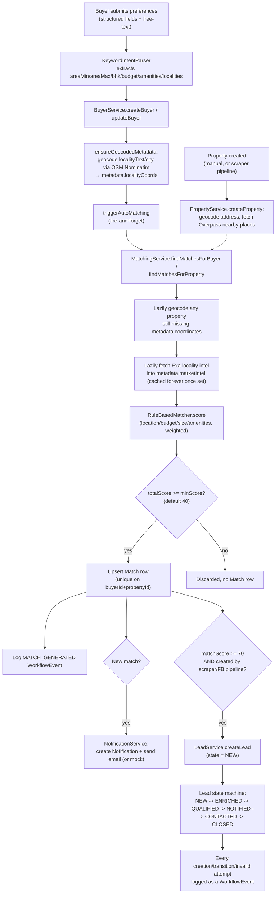

# Matching & Data Flow

## Purpose & scope
The complete, end-to-end path data takes from a buyer's preferences (or a newly scraped/created property) through to a scored `Match`, a `Lead`, and a notification. For the exact scoring formulas and weights, see `docs/Matching_Algorithm_Report.md` (kept as the authoritative source — not duplicated here). For the underlying data shapes, see [DATA_MODEL.md](./DATA_MODEL.md).

## Pipeline diagram

## Step-by-step

1. **Preference intake.** A buyer's structured fields (budget, BHK, amenities) plus a free-text `rawPreferences` string are both accepted. The free text is run through `KeywordIntentParser` (`src/backend/src/parsers/intent-parser.ts`), which extracts `areaMin`/`areaMax`/`bhk`/`budgetMin`/`budgetMax`/`amenities`/`localities` via keyword matching. Explicit structured fields in the request always take precedence over parsed values where both are present.

2. **Geocoding on write.** `BuyerService.createBuyer`/`updateBuyer` call `ensureGeocodedMetadata` (`src/backend/src/services/buyer.service.ts:10-35`): if `metadata.localityCoords` isn't already set but `metadata.localityText` or `metadata.city` is, it geocodes that text via `GeocodeService.geocodeAddress` (OSM Nominatim, rate-limited to 1 request/second) and stores the result. On failure it sets `metadata.geocodeFailed = true` so it doesn't retry every time. **This step is a hard dependency for matching** — a buyer with no `localityCoords` scores zero on location for every property, and the matcher hard-discards anything scoring below 25 on location (see below), so a buyer who never gets geocoded receives no matches at all regardless of how well their budget/size/amenities fit.

3. **Property creation & enrichment.** `PropertyService.createProperty` geocodes the property's address/locality on creation and fetches nearby points of interest (airport/bus/train/hospital) from the Overpass API, storing both in `metadata.coordinates`/`metadata.nearbyPlaces`. Properties can also arrive via the scraper pipeline (see below) rather than manual creation.

4. **Matching trigger.** Every buyer create/update fire-and-forgets `BuyerService.triggerAutoMatching`, which calls `MatchingService.findMatchesForBuyer`. The same service also exposes `findMatchesForProperty`, called when a property is created/updated or by the scraper pipeline.

5. **Lazy enrichment inside matching.** Before scoring, `MatchingService` (`src/backend/src/services/matching.service.ts:33-95`) checks every active property: if it's missing `metadata.coordinates`, it geocodes it; if it's missing `metadata.marketIntel`, it calls `getLocalityIntel` (`src/backend/src/services/locality-intel.service.ts`), which queries Exa AI's `/answer` endpoint for a short, locality-specific market-trends summary. Both results are cached indefinitely on the property once set (or marked `*Failed: true` on failure) — this enrichment only ever runs once per property, not once per match computation.

6. **Scoring.** `RuleBasedMatcher.score` (`src/backend/src/matchers/rule-based-matcher.ts`) computes four component scores — location (Haversine distance-based, `src/backend/src/utils/haversine.ts`), budget, size (BHK + area), amenities — combined with fixed weights (35/30/20/15). A hard rule discards the entire match (forces `totalScore = 0`) if the location component scores below 25, regardless of the other three components. Exact formulas: `docs/Matching_Algorithm_Report.md`.

7. **Persistence & side effects.** Matches scoring at or above `minScore` (default 40) are upserted into the `Match` collection (one row per buyer/property pair, re-matching updates rather than duplicates). Every match computation logs a `MATCH_GENERATED` `WorkflowEvent`. If any match is newly created (not just re-scored), `NotificationService` creates an in-app `Notification` and attempts to send an email via `EmailService` (silently mocked to a console log if SMTP isn't configured).

8. **Lead creation.** A `Lead` is *not* created automatically just because a `Match` exists. Leads come from two paths: an explicit `POST /api/leads` call (any role, subject to access checks), or automatically from the scraper/Facebook-scraper pipelines whenever a freshly generated match scores ≥70 (`src/backend/src/services/scraping.service.ts:290-303`, `src/backend/src/index.ts:414-427`). This distinction matters operationally — bulk-refreshing matches (`POST /api/matches/refresh-all`) does not by itself generate any leads.

9. **Lead lifecycle.** Once created, a `Lead` moves through a strictly linear state machine (`src/backend/src/workflows/state-machine.ts`): `NEW → ENRICHED → QUALIFIED → NOTIFIED → CONTACTED → CLOSED`, with `CLOSED` terminal and no skipping or backward moves allowed. `LeadService.transitionState` validates every transition and logs both successful transitions and rejected/invalid attempts as `WorkflowEvent` rows, giving a full audit trail per lead.

## Scraper-originated data
Properties don't only come from sellers filling out a form — the scraper pipeline (`src/backend/scraper/`) pulls real listings from external sites and feeds them into step 3 above via `ScrapingService`, which creates a placeholder `Seller` per scraped seller name and a `Property` via the same `PropertyService.createProperty` path, then immediately runs matching for that property. See [ARCHITECTURE.md](./ARCHITECTURE.md) for the scraper subsystem overview.

---
*Last verified against commit `b5d6462`.*
