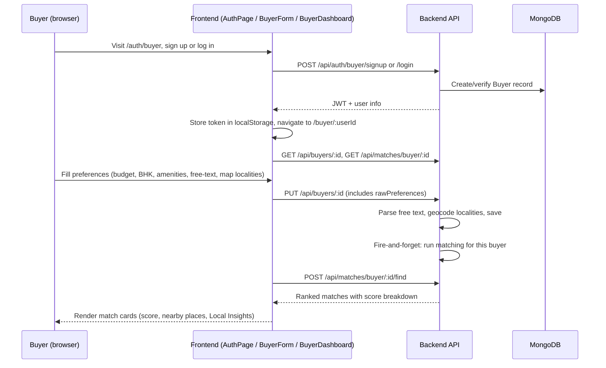
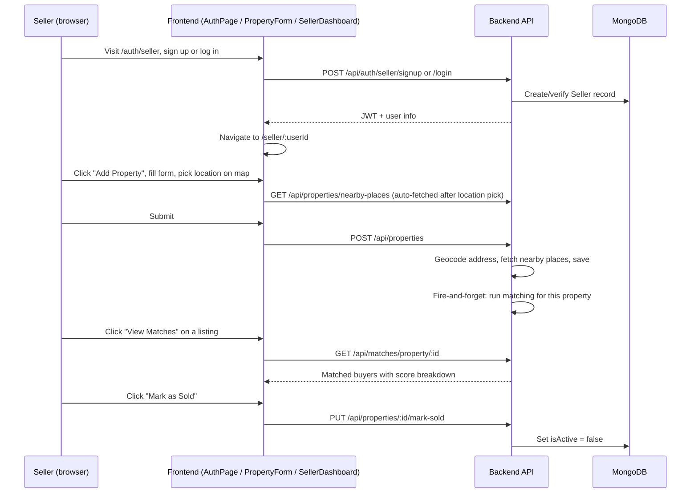
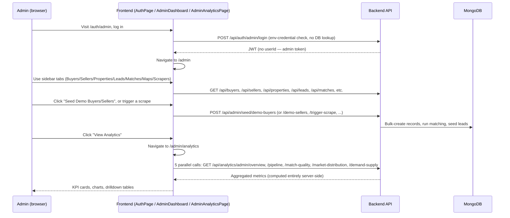

# User Flows

## Purpose & scope
Three complete, real (not idealized) user journeys — buyer, seller, admin — each traced from the actual frontend component through the actual backend route to the actual database write. See [FRONTEND_ARCHITECTURE.md](./FRONTEND_ARCHITECTURE.md) and [API_REFERENCE.md](./API_REFERENCE.md) for the pieces referenced here, and [MATCHING_AND_DATA_FLOW.md](./MATCHING_AND_DATA_FLOW.md) for what happens after a buyer's preferences are saved.

## Buyer flow

The buyer never triggers geocoding or matching directly — both happen server-side as a consequence of saving preferences. The frontend's "Local Insights" and "Nearby Places" blocks are pure display of data the backend already computed and stored on the property; no extra request happens per match card.

## Seller flow

## Admin flow

Admin sub-view navigation (Buyers vs. Sellers vs. Properties, etc.) is local component state, not routing — see [FRONTEND_ARCHITECTURE.md](./FRONTEND_ARCHITECTURE.md) for why that means these views aren't individually linkable.

---
*Last verified against commit `ce81d04`.*
